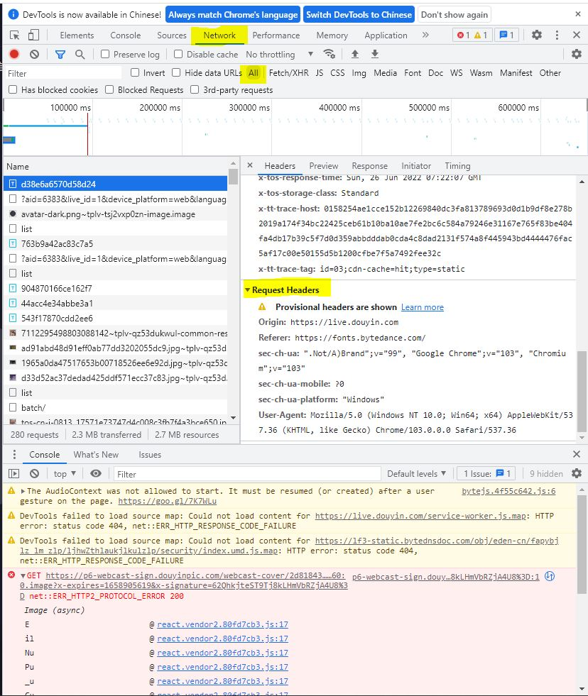

README
===========================
Use requests and lxml packages to collect data from website https://live.douyin.com/  

Add `headers` to pretend to be a real user:  
```python
headers = {
    "User-Agent": "Mozilla/5.0 (Windows NT 10.0; Win64; x64) AppleWebKit/537.36 (KHTML, like Gecko) Chrome/99.0.4844.82 Safari/537.36",
    "Cookie": "MONITOR_WEB_ID=15ad6562-5721-4b9c-9924-95d207074acd; MONITOR_DEVICE_ID=bdbe1741-3e9e-4993-9ea5-603d42c5050f; douyin.com; ttcid=4de8ae0b245f4896bfdacfe0c99dd0e830; ttwid=1|0hjlRNdnSLx5P2zO5r4-Ncy0s3quuVlcHr2C1Ixp3T4|1646720594|b8666d0705929f2b298dac2c7e30440016632f611c9f987906d17bc97008284f; MONITOR_WEB_ID=22616c02-668c-43c1-9196-0cfc297e1b48; passport_csrf_token_default=9a5635b36379aaef3160f68996b617fe; passport_csrf_token=9a5635b36379aaef3160f68996b617fe; MONITOR_DEVICE_ID=4fc37e0f-c56b-4240-9816-94631e9d10ac; _tea_utm_cache_6383=undefined; _tea_utm_cache_2285=undefined; _tea_utm_cache_1300=undefined; THEME_STAY_TIME=299761; IS_HIDE_THEME_CHANGE=1; pwa_guide_count=3; __ac_nonce=0623d305d002b616b8d7e; __ac_signature=_02B4Z6wo00f01YpbFsgAAIDBClnsiL3UQ8GKfxJAAACsi0oW4wUD8YRFzXCjf83TH4Qyj0irfcwSpYFEIY0Xmp7AGv-8GNT.jRFZJWxRO8lvg9rYluMt.jPji.mV0ZcW-eCUCs2lkwesboqv62; strategyABtestKey=1648177248.185; AB_LOGIN_GUIDE_TIMESTAMP=1648177248126; s_v_web_id=verify_l15ulq23_aOiUECho_A86j_4aYC_9BMK_4IZqELzPkz5G; DOUYIN_WEB_HIDE_IM_LOGIN_GUIDE=11; live_can_add_dy_2_desktop=0; msToken=IN81oobIMChdqRAU0MZpk8DomZTh1NKO_oATNwmqIOClbF7Xm74zSbO0AKnhPne6XHYRweJ1Sq5mZVBGwJO-Re5KWro0-9s4uMLnGr2hLW8Hcih_Ybo52g==; home_can_add_dy_2_desktop=1; tt_scid=M8b2Nm0rlgWDbZHp-sy37gAqLg4PtCFxEphy5wTEDkhEqjJRVZDo2pYdC844ZglEe1f7; n_mh=f2T98qC_bXxSUAIlHU6iXq4YpTdHx0TSa0p9KKjv-_o; sso_uid_tt=c48cda7b154d47632730e1fe415b0476; sso_uid_tt_ss=c48cda7b154d47632730e1fe415b0476; toutiao_sso_user=7025c07e8249335c0c63aa7ddf79ec50; toutiao_sso_user_ss=7025c07e8249335c0c63aa7ddf79ec50; sid_ucp_sso_v1=1.0.0-KGIyZjYxOTllOTE3YTI1Yzk5MzdmYjYwOTM3YjkwMWZmYjc5NzE2YTEKHgidweDLtPV7EJfu9JEGGO8xIAww0rDS_QU4BkD0BxoCbGYiIDcwMjVjMDdlODI0OTMzNWMwYzYzYWE3ZGRmNzllYzUw; ssid_ucp_sso_v1=1.0.0-KGIyZjYxOTllOTE3YTI1Yzk5MzdmYjYwOTM3YjkwMWZmYjc5NzE2YTEKHgidweDLtPV7EJfu9JEGGO8xIAww0rDS_QU4BkD0BxoCbGYiIDcwMjVjMDdlODI0OTMzNWMwYzYzYWE3ZGRmNzllYzUw; msToken=Ft1Ag0Rft7b3GPjqlohheMb10jVVKsTKDPDZ8Q3k0OklXsLTatACFPmYH9kVlAQuuKfG2xUG1-IX6sMvXUnN7YbXjE2ayJXU6pja_js4zFy1eQM445EoEA==; odin_tt=e1ca87181339513783c0cd2a1b3ce625e45d892711a20cc17ede564e8133b285f3cc8c5f066147f7b79107cc2987ff43b20eefa36acadd36606a841eb6e0824b; passport_auth_status=d6f84344ab7d977c59ff35621376c888,; passport_auth_status_ss=d6f84344ab7d977c59ff35621376c888,; sid_guard=4d0a3518485930237255ac25dd93b215|1648178969|5183998|Tue,+24-May-2022+03:29:27+GMT; uid_tt=7f23eb98ee30ee41b13062b93c7091fa; uid_tt_ss=7f23eb98ee30ee41b13062b93c7091fa; sid_tt=4d0a3518485930237255ac25dd93b215; sessionid=4d0a3518485930237255ac25dd93b215; sessionid_ss=4d0a3518485930237255ac25dd93b215; sid_ucp_v1=1.0.0-KDBkNzYwYjFjM2Q5NWZlOTgxZGQxMjJhNTk0Y2VkNTk5NmNhY2E2MGQKGAidweDLtPV7EJnu9JEGGO8xIAw4BkD0BxoCbGYiIDRkMGEzNTE4NDg1OTMwMjM3MjU1YWMyNWRkOTNiMjE1; ssid_ucp_v1=1.0.0-KDBkNzYwYjFjM2Q5NWZlOTgxZGQxMjJhNTk0Y2VkNTk5NmNhY2E2MGQKGAidweDLtPV7EJnu9JEGGO8xIAw4BkD0BxoCbGYiIDRkMGEzNTE4NDg1OTMwMjM3MjU1YWMyNWRkOTNiMjE1"
}
```  
This `headers` is found in the development tool of the target website as shown in the following screenshot.  
  

One should be familiar with [Xpath Syntax](https://www.w3schools.com/xml/xpath_syntax.asp#:~:text=XPath%20uses%20path%20expressions%20to,following%20a%20path%20or%20steps.) in order to parse lxml files of the website.  
The entire python code is shown as following:  
```python
#!/usr/bin/python
# -*- coding: UTF-8 -*-

import lxml
from lxml import etree
import requests
from requests.adapters import HTTPAdapter
from requests.packages.urllib3.util.retry import Retry
import json
import pandas as pd
import time
from datetime import datetime


start = time.perf_counter()
# pretend to be a real user.
headers = {
    "User-Agent": "Mozilla/5.0 (Windows NT 10.0; Win64; x64) AppleWebKit/537.36 (KHTML, like Gecko) Chrome/99.0.4844.82 Safari/537.36",
    "Cookie": "MONITOR_WEB_ID=15ad6562-5721-4b9c-9924-95d207074acd; MONITOR_DEVICE_ID=bdbe1741-3e9e-4993-9ea5-603d42c5050f; douyin.com; ttcid=4de8ae0b245f4896bfdacfe0c99dd0e830; ttwid=1|0hjlRNdnSLx5P2zO5r4-Ncy0s3quuVlcHr2C1Ixp3T4|1646720594|b8666d0705929f2b298dac2c7e30440016632f611c9f987906d17bc97008284f; MONITOR_WEB_ID=22616c02-668c-43c1-9196-0cfc297e1b48; passport_csrf_token_default=9a5635b36379aaef3160f68996b617fe; passport_csrf_token=9a5635b36379aaef3160f68996b617fe; MONITOR_DEVICE_ID=4fc37e0f-c56b-4240-9816-94631e9d10ac; _tea_utm_cache_6383=undefined; _tea_utm_cache_2285=undefined; _tea_utm_cache_1300=undefined; THEME_STAY_TIME=299761; IS_HIDE_THEME_CHANGE=1; pwa_guide_count=3; __ac_nonce=0623d305d002b616b8d7e; __ac_signature=_02B4Z6wo00f01YpbFsgAAIDBClnsiL3UQ8GKfxJAAACsi0oW4wUD8YRFzXCjf83TH4Qyj0irfcwSpYFEIY0Xmp7AGv-8GNT.jRFZJWxRO8lvg9rYluMt.jPji.mV0ZcW-eCUCs2lkwesboqv62; strategyABtestKey=1648177248.185; AB_LOGIN_GUIDE_TIMESTAMP=1648177248126; s_v_web_id=verify_l15ulq23_aOiUECho_A86j_4aYC_9BMK_4IZqELzPkz5G; DOUYIN_WEB_HIDE_IM_LOGIN_GUIDE=11; live_can_add_dy_2_desktop=0; msToken=IN81oobIMChdqRAU0MZpk8DomZTh1NKO_oATNwmqIOClbF7Xm74zSbO0AKnhPne6XHYRweJ1Sq5mZVBGwJO-Re5KWro0-9s4uMLnGr2hLW8Hcih_Ybo52g==; home_can_add_dy_2_desktop=1; tt_scid=M8b2Nm0rlgWDbZHp-sy37gAqLg4PtCFxEphy5wTEDkhEqjJRVZDo2pYdC844ZglEe1f7; n_mh=f2T98qC_bXxSUAIlHU6iXq4YpTdHx0TSa0p9KKjv-_o; sso_uid_tt=c48cda7b154d47632730e1fe415b0476; sso_uid_tt_ss=c48cda7b154d47632730e1fe415b0476; toutiao_sso_user=7025c07e8249335c0c63aa7ddf79ec50; toutiao_sso_user_ss=7025c07e8249335c0c63aa7ddf79ec50; sid_ucp_sso_v1=1.0.0-KGIyZjYxOTllOTE3YTI1Yzk5MzdmYjYwOTM3YjkwMWZmYjc5NzE2YTEKHgidweDLtPV7EJfu9JEGGO8xIAww0rDS_QU4BkD0BxoCbGYiIDcwMjVjMDdlODI0OTMzNWMwYzYzYWE3ZGRmNzllYzUw; ssid_ucp_sso_v1=1.0.0-KGIyZjYxOTllOTE3YTI1Yzk5MzdmYjYwOTM3YjkwMWZmYjc5NzE2YTEKHgidweDLtPV7EJfu9JEGGO8xIAww0rDS_QU4BkD0BxoCbGYiIDcwMjVjMDdlODI0OTMzNWMwYzYzYWE3ZGRmNzllYzUw; msToken=Ft1Ag0Rft7b3GPjqlohheMb10jVVKsTKDPDZ8Q3k0OklXsLTatACFPmYH9kVlAQuuKfG2xUG1-IX6sMvXUnN7YbXjE2ayJXU6pja_js4zFy1eQM445EoEA==; odin_tt=e1ca87181339513783c0cd2a1b3ce625e45d892711a20cc17ede564e8133b285f3cc8c5f066147f7b79107cc2987ff43b20eefa36acadd36606a841eb6e0824b; passport_auth_status=d6f84344ab7d977c59ff35621376c888,; passport_auth_status_ss=d6f84344ab7d977c59ff35621376c888,; sid_guard=4d0a3518485930237255ac25dd93b215|1648178969|5183998|Tue,+24-May-2022+03:29:27+GMT; uid_tt=7f23eb98ee30ee41b13062b93c7091fa; uid_tt_ss=7f23eb98ee30ee41b13062b93c7091fa; sid_tt=4d0a3518485930237255ac25dd93b215; sessionid=4d0a3518485930237255ac25dd93b215; sessionid_ss=4d0a3518485930237255ac25dd93b215; sid_ucp_v1=1.0.0-KDBkNzYwYjFjM2Q5NWZlOTgxZGQxMjJhNTk0Y2VkNTk5NmNhY2E2MGQKGAidweDLtPV7EJnu9JEGGO8xIAw4BkD0BxoCbGYiIDRkMGEzNTE4NDg1OTMwMjM3MjU1YWMyNWRkOTNiMjE1; ssid_ucp_v1=1.0.0-KDBkNzYwYjFjM2Q5NWZlOTgxZGQxMjJhNTk0Y2VkNTk5NmNhY2E2MGQKGAidweDLtPV7EJnu9JEGGO8xIAw4BkD0BxoCbGYiIDRkMGEzNTE4NDg1OTMwMjM3MjU1YWMyNWRkOTNiMjE1"
}


# one day (20220328) I got an issue here 'Max retries exceeded with URL in requests'. The following codes states to
# solve the problem. While I just simply executed the code again and the problem was solved.
# session = requests.Session()
# retry = Retry(connect=3, backoff_factor=0.5)
# adapter = HTTPAdapter(max_retries=retry)
# session.mount('http://', adapter)
# session.mount('https://', adapter)
#
# session.get(url)

# 'rb' b/c error: """'gbk' codec can't decode byte 0xad"""
# https://live.douyin.com/category/1_620 for '主机单机'.
# f = open('douyin/douyin_live_主机单机_0324_11.txt', 'rb')
#
# html = f.read().decode('utf-8')
# f.close()

# That's for the past category.
# src_file = {'主机单机': 'douyin/douyin_live_主机单机_0430_20.txt',
#             '娱乐天地': 'douyin/douyin_live_娱乐天地_0430_20.txt',
#             '手机游戏': 'douyin/douyin_live_手机游戏_0430_20.txt',
#             '棋牌游戏': 'douyin/douyin_live_棋牌桌游_0430_20.txt',
#             '科技文化': 'douyin/douyin_live_科技文化_0430_20.txt',
#             '网游竞技': 'douyin/douyin_live_竞技游戏_0430_20.txt',
#             '射击游戏': 'douyin/douyin_live_射击游戏_0430_20.txt'}


src_file = {'主机单机': 'douyin/douyin_live_主机单机_0604_22.txt',
            '棋牌桌游': 'douyin/douyin_live_棋牌桌游_0604_22.txt',
            '角色扮演': 'douyin/douyin_live_角色扮演_0604_22.txt',
            '休闲游戏': 'douyin/douyin_live_休闲游戏_0604_22.txt',
            '竞技游戏': 'douyin/douyin_live_竞技游戏_0604_22.txt',
            '策略游戏': 'douyin/douyin_live_策略游戏_0604_22.txt',
            '射击游戏': 'douyin/douyin_live_射击游戏_0604_22.txt',
            '娱乐天地': 'douyin/douyin_live_娱乐天地_0604_22.txt',
            '科技文化': 'douyin/douyin_live_科技文化_0604_22.txt'}


# for cat1 in ['射击游戏', '娱乐天地', '科技文化']:
for cat1 in src_file.keys():
    file = open(src_file[cat1], 'rb')
    html = file.read().decode('utf-8')
    file.close()

    # use Xpath to parse html files.
    tree = etree.HTML(html)

    # store info for
    lst_id = []
    lst_name = []
    lst_live_adr = []
    lst_live_title = []
    lst_live_cat1 = []
    lst_live_cat2 = []
    lst_live_pop = []
    lst_per_adr = []
    lst_per_follow = []
    lst_per_fans = []
    lst_per_like = []
    lst_per_video_num = []
    lst_per_intro = []
    lst_date = []
    # time cal.ed as hours (e.g., 13 P.M. as 13)
    lst_time_h = []

    for i, streamer in enumerate(tree.xpath("""//li[@class="EbVU9bTb"]""")):
        # adr for abbreviation of address. stm for abbreviation of streamer.
        stm_live_adr = streamer.xpath("a/@href")[0]
        # pop for popularity.
        stm_live_pop = tree.xpath(F"""//li[{i+1}][@class="EbVU9bTb"]//span[@class='We+SxQ2L']/text()""")
        if len(stm_live_pop) > 0:
            stm_live_pop = stm_live_pop[0]
        else:
            stm_live_pop = ''
        # subcat for sub category.
        stm_subcat = tree.xpath(F"""//li[{i+1}][@class="EbVU9bTb"]//span[@class='WigkTOdC']/text()""")
        if len(stm_subcat) > 0:
            stm_subcat = stm_subcat[0]
        else:
            stm_subcat = ''
        # name of the streamer.
        stm_name = tree.xpath(F"""//li[{i+1}][@class="EbVU9bTb"]//span[@class='Lg3oyBpt']/text()""")
        if len(stm_name) > 0:
            stm_name = stm_name[0]
        else:
            stm_name = ''
        # title of the studio.
        stm_live_title = streamer.xpath("a/@title")
        if len(stm_live_title) > 0:
            stm_live_title = stm_live_title[0]
        else:
            stm_live_title = ''

        # get streamer's personal website by clicking into his/her studio.
        #  get studio src website.
        # time.sleep(5)
        session = requests.Session()
        retry = Retry(connect=3, backoff_factor=0.5)
        adapter = HTTPAdapter(max_retries=retry)
        session.mount('http://', adapter)
        session.mount('https://', adapter)
        stm_studio_html = session.get(stm_live_adr, headers=headers)
        tree_studio = etree.HTML(stm_studio_html.text)
        #  get personal src website.
        #   website got this way is like '//www.balabala'.
        #  some user set their account to be private. This case we can not get their personal address via this xpath.
        if len(tree_studio.xpath("""//div[@class="Ju7i0i9s"]/a[@class="td9sqpgC"]/@href""")) == 0:
            stm_per_adr = ''
            stm_acc_num = ''
            stm_name = ''
            stm_follow = ''
            stm_fans = ''
            stm_like = ''
            stm_video_num = ''
            stm_intro = ''
        else:

            stm_per_adr = 'https:' + tree_studio.xpath("""//div[@class="Ju7i0i9s"]/a[@class="td9sqpgC"]/@href""")[0]
            # one day (20220328) I got an issue here 'Max retries exceeded with URL in requests'. The following codes
            # states to solve the problem. While I just simply executed the code again and the problem was solved.

            session = requests.Session()
            retry = Retry(connect=3, backoff_factor=0.5)
            adapter = HTTPAdapter(max_retries=retry)
            session.mount('http://', adapter)
            session.mount('https://', adapter)
            time.sleep(2)
            stm_per_html = session.get(stm_per_adr, headers=headers)
            tree_stm_per = etree.HTML(stm_per_html.text)
            # account number.
            if len(tree_stm_per.xpath("""//p[@class="nLpBdOIE"]/text()""")) >= 2:
                stm_acc_num = tree_stm_per.xpath("""//p[@class="nLpBdOIE"]/text()""")[1]
            else:
                stm_acc_num = ''
            # 关注
            if len(tree_stm_per.xpath("""//div[@class="ojricq5F"]/div[1]/div/text()""")) > 0:
                stm_follow = tree_stm_per.xpath("""//div[@class="ojricq5F"]/div[1]/div/text()""")[1]
            else:
                stm_follow = ''
            # 粉丝
            try:
                stm_fans = tree_stm_per.xpath("""//div[@class="ojricq5F"]/div[2]/div/text()""")[1]
            except:
                stm_fans = ''
            # 获赞
            try:
                stm_like = tree_stm_per.xpath("""//div[@class="ojricq5F"]/div[3]/div/text()""")[1]
            except:
                stm_like = ''
            # num. of videos.
            try:
                stm_video_num = tree_stm_per.xpath("""//div[@class="CANY1MjK GKO_f9Vh"]/span/text()""")[0]
            except:
                stm_video_num = ''

            # introduction. list of text info.
            stm_intro = tree_stm_per.xpath("""//p[@class="iGjCnS2C"]/span[@class="Nu66P_ba"]//*/text()""")

        # get result values.
        lst_id.append(stm_acc_num)
        lst_name.append(stm_name)
        lst_live_adr.append(stm_live_adr)
        lst_live_title.append(stm_live_title)
        lst_live_cat1.append(cat1)
        lst_live_cat2.append(stm_subcat)
        lst_live_pop.append(stm_live_pop)
        lst_per_adr.append(stm_per_adr)
        lst_per_follow.append(stm_follow)
        lst_per_fans.append(stm_fans)
        lst_per_like.append(stm_like)
        lst_per_video_num.append(stm_video_num)
        lst_per_intro.append(stm_intro)

        # add time column.
        now = datetime.now()

        lst_date.append(now.strftime("%d/%m/%Y"))
        lst_time_h.append(now.strftime("%H"))

    # get result df.
    df_rlt_slice = pd.DataFrame(data={'id': lst_id,
                                      'name': lst_name,
                                      'live_adr': lst_live_adr,
                                      'live_title': lst_live_title,
                                      'live_cat1': lst_live_cat1,
                                      'live_cat2': lst_live_cat2,
                                      'live_pop': lst_live_pop,
                                      'per_adr': lst_per_adr,
                                      'per_follow': lst_per_follow,
                                      'per_fans': lst_per_fans,
                                      'per_like': lst_per_like,
                                      'per_video_num': lst_per_video_num,
                                      'per_intro': lst_per_intro,
                                      'date': lst_date,
                                      'time_h': lst_time_h})

    # get current date.
    now = datetime.now()
    df_rlt_slice.to_excel(F'rlt_{cat1}_{now.strftime("%H_%d_%m_%Y")}.xlsx', index=False)


end = time.perf_counter()
print(F"execution time(s):{end - start}")

# 0327_23 execution time(s):1190.2391678999998
# 0330 execution time(s):3847.128349900002
# 0331_11 execution time(s):4049.6230929
# 0401_10 execution time(s):5478.2695693
# 0402_02 execution time(s):4400.161041900001
# 0402_21 execution time(s):4000.8178337
# 0403_21 execution time(s):1447.2391513
# 0404_10 execution time(s):1446.5915278999964
# 0404_21 execution time(s):1391.9325205
# 0405_10 execution time(s):2642.8795136
# 0406_10 execution time(s):4643.2943168
# 0407_09 execution time(s):4315.4290209
# 0408_11 execution time(s):5066.8241335
# 0409_21 execution time(s):2554.0555552
# 0411_14 execution time(s):2597.6610419999997
# 0420_10 execution time(s):5182.452563299999
# 0420_21 execution time(s):3126.6125191
# 0421_11 execution time(s):2979.7395985
# 0523_11 execution time(s):4051.674750799997
# 0604_22 execution time(s):1499.2174263
```  

I met issues along the way running these codes from time to time. Problems often occurred near the `requests.get` part of the code, sometimes I just rerunned the code or added `sleep(3)` before the `.get` method and the issue was solved, [other times](https://github.com/psf/requests/issues/1198) I had to add the following codes in replace of `requests.get` method (sorry I forget the address of the original post solving this issue).  
```python
# one day (20220328) I got an issue here 'Max retries exceeded with URL in requests'. The following codes states to
# solve the problem. While I just simply executed the code again and the problem was solved.
session = requests.Session()
retry = Retry(connect=3, backoff_factor=0.5)
adapter = HTTPAdapter(max_retries=retry)
session.mount('http://', adapter)
session.mount('https://', adapter)

session.get(url)
```
